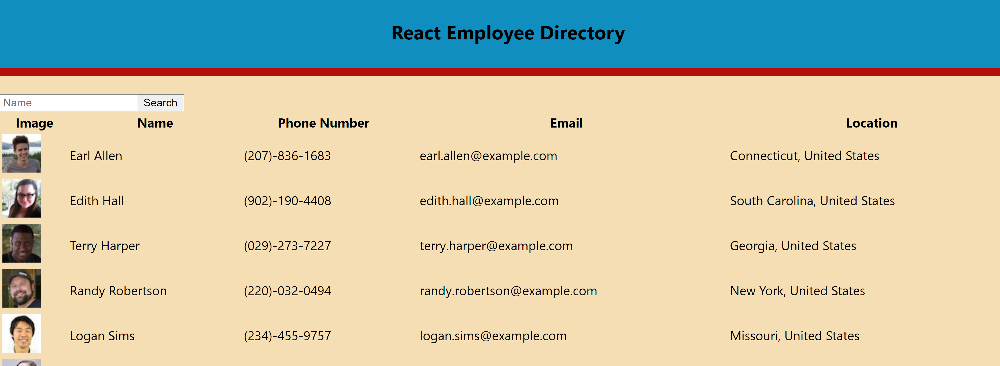
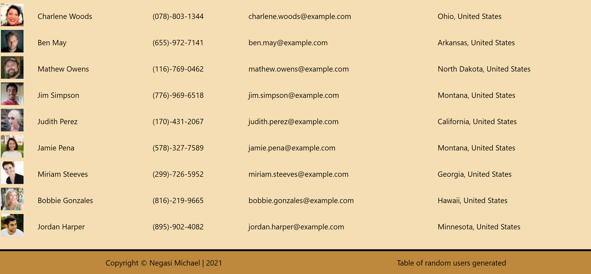

# employee-directory
------------------------------------------------------------------------
### Description

This application  utilizes an API to populate random users and then create a directory. In the directory can search employees by name and also organize each field (Name, Email, telephone number) in ascending or descending order.

## Table of Contents
   * [Installation](#installation)
   
   * [Contribution](#contribution)
   
   * [Developer Contact Information](#Developer-Contact-Information)
     
  * [License](#license)

### Installation

npx create-react-app  < app name >

npm start

 ## Screenshot Image
   

Deployed: https://negasimichael.github.io/employee-directory/
## Contribution
  [negasimichael](https://github.com/negasimichael/employee-directory) is the only contrubuter of this project .

## Developer Contact Information
  * Linkedin Profile: [negasimichael](https://www.linkedin.com/feed/)
  * Deployed URL: [negasimichael](https://negasimichael.github.io/employee-directory/)
  * Github URL: [negasimichael](https://github.com/negasimichael/employee-directory)
  * Email: negasimichael1@gmail.com
  
## License
   .
 
 ------------------------------------------------------------------------------
© 2021 Trilogy Education Services, a 2U, Inc. brand. All Rights Reserved.
